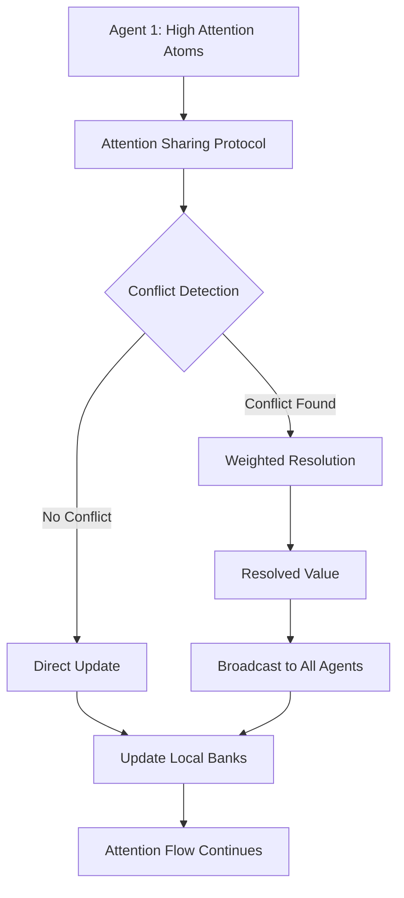

# Phase 2: ECAN Dynamic Mesh Topology & Resource Allocation

## Overview
This document details the dynamic mesh topology implementation for Economic Attention Networks (ECAN) in Phase 2, including distributed agent coordination, attention synchronization protocols, and recursive resource allocation pathways.

## 🌐 Dynamic Mesh Architecture

### Mesh Components
```
┌─────────────────┐    ┌─────────────────┐    ┌─────────────────┐
│  Cognitive      │    │  Cognitive      │    │  Cognitive      │
│  Agent 1        │◄──►│  Agent 2        │◄──►│  Agent 3        │
│                 │    │                 │    │                 │
│ • ECANAgent     │    │ • ECANAgent     │    │ • ECANAgent     │
│ • AttentionBank │    │ • AttentionBank │    │ • AttentionBank │
│ • Local Focus   │    │ • Local Focus   │    │ • Local Focus   │
└─────────┬───────┘    └─────────┬───────┘    └─────────┬───────┘
          │                      │                      │
          │                      │                      │
          └──────────────────────┼──────────────────────┘
                                 │
                    ┌─────────────▼───────────┐
                    │   Resource Manager      │
                    │                         │
                    │ • ECANResourceManager   │
                    │ • Global Allocation     │
                    │ • Conflict Resolution   │
                    │ • Fairness Monitoring   │
                    └─────────────────────────┘
```

### Network Topology Characteristics
- **Decentralized**: No single point of failure
- **Self-organizing**: Agents can join/leave dynamically
- **Adaptive**: Connection patterns adjust based on attention flow
- **Fault-tolerant**: System continues operating with partial failures

## 📡 Attention Synchronization Protocols

### 1. Attention State Broadcasting
```python
# Attention synchronization message format
{
    "message_type": "attention_update",
    "source_agent": "cognitive_agent_1", 
    "timestamp": 1634567890.123,
    "attention_data": {
        "atom_id": "concept_X",
        "attention_tensor": [0.8, 0.7, 0.9, 0.6, 0.5, 0.95],  # 6D ECAN tensor
        "confidence": 0.85,
        "update_reason": "high_priority_stimulation"
    },
    "propagation_path": ["agent_1", "agent_2", "resource_manager"]
}
```

### 2. Conflict Resolution Protocol
When multiple agents have conflicting attention values for the same atom:

```
Step 1: Detect Conflict
├── Agent A: atom_X = 0.8 STI
├── Agent B: atom_X = 0.6 STI
└── Agent C: atom_X = 0.9 STI

Step 2: Gather Evidence  
├── Confidence scores: [0.9, 0.7, 0.85]
├── Recent usage: [high, low, medium]
└── Spreading potential: [0.72, 0.42, 0.81]

Step 3: Weighted Resolution
├── Weight = confidence × (1 + attention_value)
├── Weighted average: (0.8×1.71 + 0.6×1.12 + 0.9×1.77) / (1.71+1.12+1.77)
└── Resolved value: 0.83 STI

Step 4: Propagate Resolution
├── Broadcast resolved value to all agents
├── Update local attention banks
└── Log conflict resolution for analysis
```

### 3. Cross-Agent Attention Flow


## ⚡ Priority Queue-Based Resource Scheduling

### Request Priority Calculation
```python
def calculate_request_priority(request):
    """Calculate priority for attention allocation request"""
    
    # Base priority factors
    urgency_weight = 0.4
    confidence_weight = 0.3  
    temporal_weight = 0.2
    resource_weight = 0.1
    
    # Extract ECAN tensor components
    tensor = request.attention_tensor
    urgency = tensor[2]  # urgency component
    confidence = tensor[3]  # confidence component
    
    # Temporal factors
    time_since_request = current_time - request.timestamp
    temporal_decay = exp(-time_since_request / decay_constant)
    
    # Resource availability
    resource_factor = available_resources / total_resources
    
    priority = (urgency * urgency_weight +
               confidence * confidence_weight +
               temporal_decay * temporal_weight +
               resource_factor * resource_weight)
               
    return min(1.0, max(0.0, priority))
```

### Scheduling Queue Structure
```
Priority Queue (Max-Heap):
┌─────────────────────────────────────┐
│ Priority: 0.95 | stimulate atom_A   │ ← Highest Priority
├─────────────────────────────────────┤
│ Priority: 0.87 | spread from atom_B │
├─────────────────────────────────────┤
│ Priority: 0.73 | decay atom_C       │
├─────────────────────────────────────┤
│ Priority: 0.61 | refresh atom_D     │
└─────────────────────────────────────┘
                    ↓
            [Process up to N requests per cycle]
```

## 🔄 Recursive Resource Allocation Pathways

### Allocation Tree Structure
```
System Resources (1000 units)
├── Cognitive Processing (40%) = 400 units
│   ├── Attention System (50%) = 200 units
│   │   ├── STI Processing (60%) = 120 units
│   │   ├── LTI Processing (30%) = 60 units  
│   │   └── Attention Spreading (10%) = 20 units
│   └── Reasoning System (50%) = 200 units
│       ├── Pattern Matching (40%) = 80 units
│       ├── Inference (35%) = 70 units
│       └── Memory Access (25%) = 50 units
├── Learning & Adaptation (30%) = 300 units
│   ├── Pattern Recognition (50%) = 150 units
│   └── Memory Consolidation (50%) = 150 units
└── Communication & Sync (30%) = 300 units
    ├── Inter-Agent Sync (67%) = 200 units
    │   ├── Attention Sync (60%) = 120 units
    │   ├── Conflict Resolution (25%) = 50 units
    │   └── State Propagation (15%) = 30 units
    └── External Interface (33%) = 100 units
```

### Dynamic Reallocation Algorithm
```python
def recursive_reallocation(node, available_resources, demand_factors):
    """Recursively allocate resources based on current demand"""
    
    if node.is_leaf():
        # Base case: allocate to leaf node
        base_allocation = node.base_allocation
        demand_multiplier = demand_factors.get(node.id, 1.0)
        
        # Apply demand-based adjustment
        requested = base_allocation * demand_multiplier
        allocated = min(requested, available_resources)
        
        return allocated, available_resources - allocated
    
    else:
        # Recursive case: distribute among children
        total_allocated = 0
        remaining_resources = available_resources
        
        # Sort children by priority/demand
        sorted_children = sorted(node.children, 
                               key=lambda c: demand_factors.get(c.id, 1.0), 
                               reverse=True)
        
        for child in sorted_children:
            if remaining_resources <= 0:
                break
                
            # Recursively allocate to child
            child_allocation, remaining_resources = recursive_reallocation(
                child, remaining_resources * child.allocation_ratio, demand_factors)
            
            total_allocated += child_allocation
            
        return total_allocated, remaining_resources
```

## 🛡️ Mesh Resilience & Fault Tolerance

### Failure Detection
```python
class MeshResilienceMonitor:
    def __init__(self):
        self.agent_heartbeats = {}
        self.failure_threshold = 5.0  # seconds
        
    def monitor_agent_health(self):
        current_time = time.time()
        failed_agents = []
        
        for agent_id, last_heartbeat in self.agent_heartbeats.items():
            if current_time - last_heartbeat > self.failure_threshold:
                failed_agents.append(agent_id)
                
        return failed_agents
        
    def handle_agent_failure(self, failed_agent):
        """Redistribute failed agent's responsibilities"""
        
        # 1. Redistribute attention focus
        orphaned_atoms = self.get_agent_focus_atoms(failed_agent)
        remaining_agents = self.get_active_agents()
        
        atoms_per_agent = len(orphaned_atoms) // len(remaining_agents)
        
        for i, agent in enumerate(remaining_agents):
            start_idx = i * atoms_per_agent
            end_idx = (i + 1) * atoms_per_agent if i < len(remaining_agents) - 1 else len(orphaned_atoms)
            agent.adopt_atoms(orphaned_atoms[start_idx:end_idx])
            
        # 2. Reroute attention synchronization paths
        self.update_sync_topology(exclude_agent=failed_agent)
        
        # 3. Rebalance resource allocations
        self.rebalance_resources(failed_agent_resources=self.get_agent_resources(failed_agent))
```

### Network Partitioning Handling
```
Scenario: Network partition splits agents into two groups

Group A: [Agent 1, Agent 2] ←→ Group B: [Agent 3, Resource Manager]
                               ✗ (connection lost)

Recovery Strategy:
1. Each group continues operating independently
2. Maintain local attention consistency within group  
3. Queue attention updates for cross-group synchronization
4. Upon reconnection: resolve conflicts and merge states
5. Apply conflict resolution protocols for divergent attention values
```

## 📊 Performance Metrics & Fairness Analysis

### Key Performance Indicators
```python
class ECANPerformanceMetrics:
    def __init__(self):
        self.metrics = {}
        
    def collect_metrics(self):
        return {
            # Throughput metrics
            "attention_updates_per_second": self.calculate_update_rate(),
            "conflict_resolutions_per_second": self.calculate_conflict_rate(),
            "resource_allocations_per_cycle": self.calculate_allocation_rate(),
            
            # Latency metrics  
            "average_sync_latency": self.calculate_sync_latency(),
            "conflict_resolution_time": self.calculate_resolution_time(),
            "resource_request_response_time": self.calculate_response_time(),
            
            # Fairness metrics
            "attention_distribution_gini": self.calculate_attention_gini(),
            "resource_allocation_fairness": self.calculate_resource_fairness(),
            "agent_participation_balance": self.calculate_participation_balance(),
            
            # Reliability metrics
            "system_uptime": self.calculate_uptime(),
            "failure_recovery_time": self.calculate_recovery_time(),
            "data_consistency_score": self.calculate_consistency_score()
        }
```

### Fairness Analysis Framework
```
Gini Coefficient Calculation for Attention Distribution:

G = (2 * Σ(i * x_i)) / (n * Σ(x_i)) - (n + 1) / n

Where:
- x_i = attention value for agent i (sorted)
- n = number of agents
- G ∈ [0, 1]: 0 = perfect equality, 1 = maximum inequality

Fairness Thresholds:
- Excellent (G < 0.2): Very fair distribution
- Good (0.2 ≤ G < 0.4): Acceptable fairness
- Fair (0.4 ≤ G < 0.6): Some inequality present
- Poor (G ≥ 0.6): Significant inequality, intervention needed
```

## 🔧 Configuration Parameters

### ECAN System Configuration
```yaml
ecan_configuration:
  # Attention tensor parameters
  attention_tensor:
    dimensions: 6
    value_range: [0.0, 1.0]
    normalization: true
    
  # Economic parameters  
  economic_cycles:
    rent_rate: 0.01
    wage_rate: 0.05
    tax_rate: 0.02
    decay_factor: 0.95
    
  # Mesh topology
  mesh_topology:
    max_connections_per_agent: 10
    heartbeat_interval: 1.0  # seconds
    failure_detection_threshold: 5.0  # seconds
    
  # Resource scheduling
  resource_scheduling:
    max_requests_per_cycle: 10
    priority_decay_constant: 2.0
    allocation_fairness_threshold: 0.8
    
  # Synchronization
  synchronization:
    sync_interval: 10  # cycles
    conflict_resolution_timeout: 1.0  # seconds
    max_propagation_hops: 5
```

## 📈 Expected Performance Characteristics

### Scalability Targets
- **Small Scale** (3-5 agents): >1000 attention updates/second
- **Medium Scale** (10-20 agents): >500 attention updates/second  
- **Large Scale** (50+ agents): >200 attention updates/second

### Latency Requirements
- **Attention Synchronization**: <10ms average
- **Conflict Resolution**: <100ms average
- **Resource Allocation**: <50ms average

### Fairness Guarantees
- **Attention Distribution Gini**: <0.4 (Good fairness)
- **Resource Allocation Fairness**: >0.7 (Acceptable fairness)
- **Agent Participation Balance**: >0.8 (High participation)

## 🚀 Future Enhancements

### Phase 3 Integration Points
1. **Spatial-Temporal Reasoning**: Integrate spacetime component for location-aware attention
2. **Advanced PLN Integration**: Probabilistic logic networks for uncertain attention values
3. **Learning-Based Optimization**: Adaptive parameter tuning based on system performance
4. **Hierarchical Mesh Topology**: Multi-layer agent hierarchies for large-scale deployment

### Research Directions
- **Quantum-Inspired Attention**: Superposition and entanglement concepts for attention states
- **Neuromorphic Hardware**: Specialized hardware for ECAN processing
- **Federated Learning**: Privacy-preserving attention synchronization
- **Swarm Intelligence**: Emergent collective attention behaviors

---

**Documentation Version**: 1.0  
**Last Updated**: Phase 2 Implementation  
**Next Review**: Phase 3 Integration